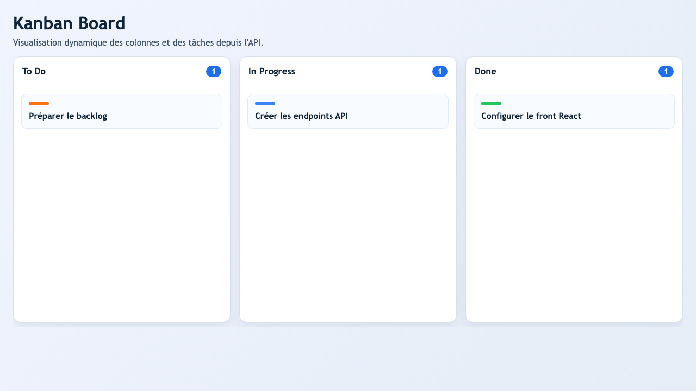
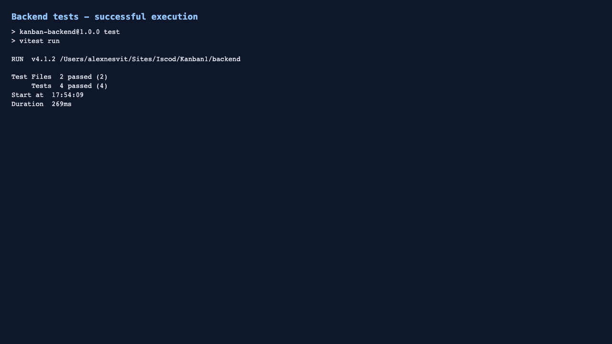

# Rapport de réalisation - Projet Kanban (Exercices 1 à 9)

## Exercice 1
Statut: non traité dans ce dépôt pendant cette session.

## Exercice 2
Statut: non traité dans ce dépôt pendant cette session.

## Exercice 3 - Initialisation de l'environnement technique
Deux projets distincts ont été créés:
- `backend`: Node.js + Express
- `frontend`: React (Vite)

Structure principale:
```text
.
├── backend
│   ├── package.json
│   └── src
│       ├── app.js
│       ├── controllers
│       ├── middlewares
│       ├── models
│       ├── routes
│       ├── services
│       └── server.js
├── frontend
│   ├── package.json
│   └── src
│       ├── components
│       ├── pages
│       ├── services
│       └── styles
└── docs
```

Extraits `package.json`:
- backend: scripts `dev`, `start`, `test`
- frontend: scripts `dev`, `build`, `preview`

## Exercice 4 - Vérification du fonctionnement (backend + frontend + communication)
Vérifications réalisées:
- démarrage backend Express sur `http://localhost:5001` (port 5000 occupé localement),
- démarrage frontend React sur `http://localhost:5174`,
- test de communication front->API via `/api/tasks`,
- test direct API `/api/health`.

Capture (log):
```text
Server listening on http://localhost:5001
VITE ... Local: http://localhost:5174/
curl /api/tasks -> JSON des tâches
curl /api/health -> {"message":"API is running"}
```

## Exercice 5 - Premiers composants métier côté serveur
Implémentation des modèles métier:
- `Column`: `id`, `name`
- `Task`: `id`, `name`, `color`, `columnId`

Ajouts:
- génération d'un jeu de démonstration,
- contrôle de cohérence (chaque `task.columnId` référence une colonne existante),
- validation minimale des champs.

Fichiers principaux:
- `backend/src/models/columnModel.js`
- `backend/src/models/taskModel.js`
- `backend/src/services/taskService.js`

## Exercice 6 - Premières routes API
Route ajoutée pour fournir une charge utile exploitable côté front:
- `GET /api/board` -> `{ columns: [...], tasks: [...] }`

Fichiers:
- `backend/src/routes/boardRoutes.js`
- `backend/src/controllers/boardController.js`
- branchement dans `backend/src/app.js`

## Exercice 7 - Tests automatisés (route API)
Tests unitaires/API ajoutés sur la route board:
- statut HTTP attendu,
- format attendu des données,
- gestion des erreurs.

Fichier de test:
- `backend/tests/boardRoutes.test.js`

Capture (log):
```text
Test Files  1 passed (1)
Tests       2 passed (2)
```

## Exercice 8 - Interface utilisateur React (Kanban)
Interface Kanban réalisée avec composants réutilisables:
- `KanbanBoard` (chargement asynchrone + état `loading/error`),
- `KanbanColumn`,
- `KanbanTaskCard`.

Points clés:
- récupération dynamique des données via `/api/board`,
- affichage colonnes+tâches,
- structure HTML5/CSS3,
- adaptation desktop/tablette,
- hauteur confortable et gestion du défilement.

Fichiers:
- `frontend/src/components/KanbanBoard.jsx`
- `frontend/src/components/KanbanColumn.jsx`
- `frontend/src/components/KanbanTaskCard.jsx`
- `frontend/src/pages/HomePage.jsx`
- `frontend/src/services/taskService.js`
- `frontend/src/styles/global.css`

Capture d'écran du rendu final:
- 

## Exercice 9 - Validation, sécurisation et robustesse API
Renforcement de l'API implémenté:
- middleware de validation centralisé pour `POST /api/tasks` et `PUT /api/tasks/:taskId`,
- validation des champs obligatoires, types et cohérence des valeurs,
- messages d'erreur explicites côté client,
- gestion globale centralisée des erreurs,
- protection contre la fuite d'informations sensibles (`500 -> Internal server error`).

Fichiers:
- `backend/src/middlewares/validateTaskPayload.js`
- `backend/src/middlewares/errorHandler.js`
- `backend/src/errors/AppError.js`
- `backend/src/routes/taskRoutes.js`
- `backend/src/controllers/taskController.js`
- `backend/src/services/taskService.js`

Tests ajoutés:
- rejet de données invalides (ex: couleur invalide),
- rejet de `columnId` inexistant,
- vérification du code HTTP `400`.

Fichier de test:
- `backend/tests/taskValidation.test.js`

Capture d'exécution des tests:
- 

Résultat de la suite backend:
```text
Test Files  2 passed (2)
Tests       4 passed (4)
```
